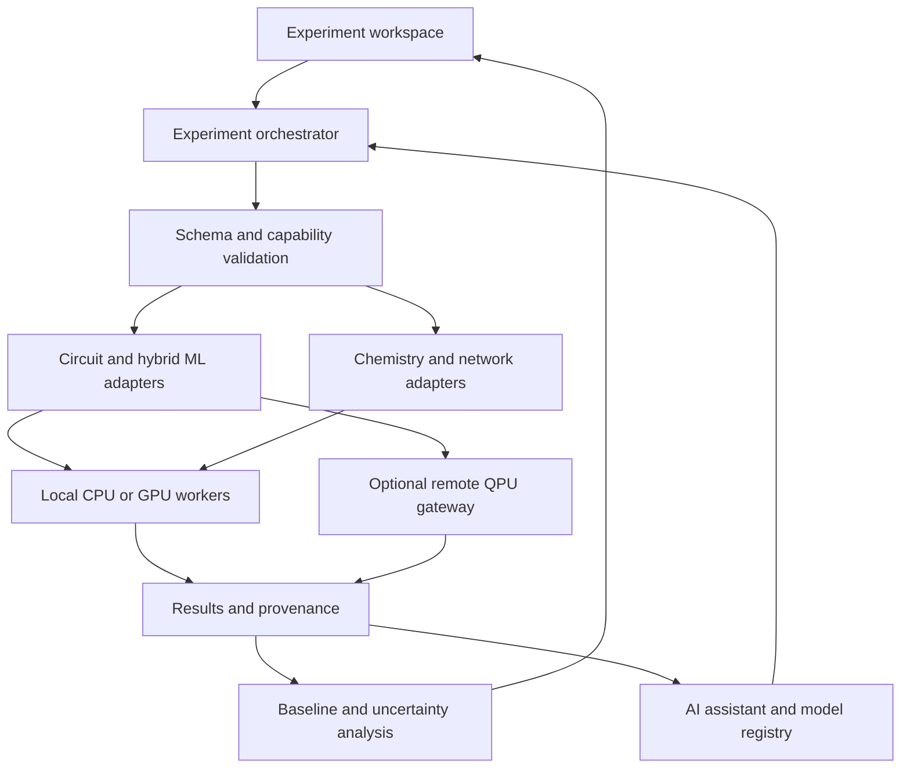

# AI-Powered Quantum Simulation Platform

**jfxoqss** proposes an open-source-first integration architecture for reproducible quantum simulation, hybrid quantum–classical machine learning, computational chemistry, and quantum communication research. It connects specialized tools through explicit adapters, experiment metadata, and independently validated results.

> **Implementation status:** This README is an architecture proposal and categorized integration roadmap. Inclusion in the compendium does not mean an adapter is implemented, tested, or supported. Cloud services, proprietary runtimes, and hardware access are optional and separately qualified.

## Goals and scope

- Provide a common experiment workspace for circuit design, classical baselines, hybrid learning, resource estimation, and scientific analysis.
- Keep circuit simulation, electronic-structure calculations, network events, and satellite QKD mission models as distinct execution domains.
- Use AI to assist experiment preparation, parameter search, surrogate modeling, and result interpretation with traceable evidence.
- Start with local CPU execution; introduce GPU, distributed workers, and remote QPUs only when a workload justifies them.
- Preserve reproducibility across Java, Python, C++, and specialized language environments without assuming that their programs are interchangeable.

No quantum advantage, hardware fidelity, or cryptographic security is established by this proposal. Such claims require workload-specific evidence.

## Proposed integration architecture

| Layer | Proposed responsibility | Integration boundary |
|---|---|---|
| Workspace | Experiment forms, notebooks, circuit views, network scenarios, and MBSE traceability | Submit versioned experiment specifications; never execute arbitrary UI-generated commands directly |
| Orchestration | Queues, cancellation, retries, resource budgets, artifact registration | Common job lifecycle; backend-specific execution and error reporting |
| AI services | Retrieval over pinned documentation, candidate circuits, parameter suggestions, surrogate models | Suggestions become reviewable artifacts; mathematical checks and measured results remain authoritative |
| Adapter registry | Backend capabilities, supported formats, dependency versions, and licensing records | Each adapter declares what it supports and explicitly rejects unsupported semantics |
| Execution workers | Isolated Java, Python, C++, chemistry, and network environments | Process or service interfaces by default; native bindings only after qualification |
| Evidence store | Inputs, outputs, logs, model versions, uncertainty, and dataset provenance | Immutable run IDs and content hashes; large scientific arrays stored separately from metadata |
| Evaluation | Classical comparisons, analytic checks, cross-simulator tests, and performance measurements | Distinguish simulator time, compilation time, queue time, and actual device time |

The initial implementation can use a local Python orchestrator, separate JVM workers, JSON manifests, SQLite metadata, and a filesystem artifact store. A later deployment may introduce PostgreSQL and distributed scheduling. These are proposed supporting choices, not existing repository components.

### Adapter contracts

Every adapter should expose equivalent operations for capability discovery, validation, submission, status, cancellation, and artifact retrieval. A failed or timed-out remote submission must not be retried blindly: retain the provider job identifier and reconcile its state first.

| Contract | Required information |
|---|---|
| Experiment manifest | Schema version, experiment ID, domain, source revision, input hashes, random seeds, objectives, and resource limits |
| Circuit input | Native format and version, supported gate set, qubit indexing and bit ordering, parameters, observables, shots, and noise configuration |
| Chemistry input | Geometry and units, charge, spin convention, basis, electronic-structure method, and convergence settings |
| Network or QKD input | Topology or orbital source, reference frame, time scale, channel and detector assumptions, protocol, and simulation horizon |
| Runtime manifest | Exact backend version, environment lock or image digest, CPU/GPU/MPI configuration, precision, and optional provider target |
| Result envelope | Status, backend job ID, metrics with units, uncertainty, output artifact hashes, elapsed times, and warnings |
| Model record | Training data provenance, split strategy, model and license identifiers, calibration metrics, and applicable operating range |

OpenQASM, cQASM, Q#, and native framework objects are different representations. Conversions must declare supported versions and features; preserve measurement semantics, classical control, parameter binding, and bit ordering. Reject unsupported constructs rather than silently changing the experiment. QIR support must be checked per selected toolchain and backend; it is not a universal interface across this catalog.

## Categorized compendium

All 20 requested entries are retained below. Project links identify upstream sources; roles and integration approaches are proposals for jfxoqss. Before adoption, pin a release or commit and review its license, dependencies, maintenance status, and reproducible examples.

### 1. Hybrid quantum–classical AI and circuit SDKs

| Project and source | Scope | Proposed integration and qualification |
|---|---|---|
| [PennyLane](https://github.com/PennyLaneAI/pennylane) | Quantum programming, differentiable workflows, machine learning, and chemistry | Primary candidate for variational learning experiments; record device plugin, differentiation method, shots, and optimizer settings |
| [TensorFlow Quantum (TFQ)](https://github.com/tensorflow/quantum) | Python framework for hybrid quantum–classical ML | Alternative TensorFlow-based learning worker; isolate its compatible TensorFlow/Cirq dependency set and compare with a classical model |
| [Cirq](https://github.com/quantumlib/Cirq) | Circuit construction, transformation, and execution | Circuit and noise-model experiments; validate conversion to other representations using small reference circuits |
| [Qiskit](https://github.com/Qiskit/qiskit) | Circuit, operator, and primitive-based quantum SDK | Circuit preparation and execution adapter; qualify simulator and provider packages separately from the core SDK |

### 2. JVM quantum programming and simulation

| Project and source | Scope | Proposed integration and qualification |
|---|---|---|
| [Strange](https://github.com/redfx-quantum/strange) | Java quantum computing API and simulator | Local JVM circuit worker and educational examples; expose results through the common job contract |
| [Quantum4J](https://github.com/quantum4j/quantum4j) | Java quantum programming stack | Candidate for Java circuit construction, simulation, and format exchange; verify supported compiler passes and QASM features at the pinned revision |
| [Jaq](https://github.com/patztablook22/jaq) | Quantum computing engine for Java | Small-circuit comparison worker; benchmark correctness and limits before considering larger workloads |
| [QuISL](https://github.com/quisl-framework/QuISL-framework-java) | Java Quantum Information Science Library | Research and educational circuit experiments; qualify build reproducibility and implemented functionality |

A JVM service interface is the default bridge to the orchestration layer. GraalVM native-image or IKVM .NET deployment, if explored later, requires separate tests for reflection, native libraries, numerical behavior, and packaging. Neither runtime is assumed to make every Java quantum library compatible automatically.

### 3. High-performance and heterogeneous simulation

| Project and source | Scope | Proposed integration and qualification |
|---|---|---|
| [QuEST](https://github.com/QuEST-Kit/QuEST) | Statevector and density-matrix simulation with parallel execution options | HPC simulation worker; choose precision and supported CPU/GPU/distributed configuration explicitly |
| [Intel Quantum Simulator (Intel-QS / qHiPSTER)](https://github.com/intel/intel-qs) | High-performance quantum circuit simulation | CPU and multi-node comparison candidate; qualify compiler, MPI configuration, scaling, and current build support |
| [QX simulator](https://github.com/QuTech-Delft/qx-simulator) | Simulation of cQASM programs | cQASM-specific execution adapter; pin language version and supported operations |
| [CUDA-Q](https://github.com/NVIDIA/cuda-quantum) | Hybrid quantum–classical programming across CPU, GPU, and QPU targets | Heterogeneous workload candidate; distinguish open toolchain code from target-specific drivers, runtimes, and provider terms |

Dense statevector storage grows as O(2^n), while dense density matrices grow as O(4^n). Admission control must estimate memory and runtime before allocating a worker. MPI partitioning and GPU acceleration do not eliminate this scaling.

### 4. Languages, resource estimation, and quantum operations

| Project and source | Scope | Proposed integration and qualification |
|---|---|---|
| [Microsoft Quantum Development Kit](https://github.com/microsoft/qdk) | Q#, resource estimation, and Quantum Katas | Q# workflows and resource-estimation artifacts; distinguish logical resource estimates from executable physical-device jobs |
| [OQTOPUS](https://github.com/oqtopus-team) | Open Quantum Toolchain for OPerators & USers | Candidate boundary for operator/user workflows; choose specific components and validate their APIs and hardware assumptions independently |
| [Avalon](https://github.com/avalon-lang) | Classical–quantum programming-language research | Experimental language track; the [earlier repository](https://github.com/ntwalibas/avalon) redirects to this organization. Verify compiler availability and current backends before scheduling experiments; historical IBM/Rigetti targets are not a present compatibility guarantee |

### 5. Computational chemistry

| Project and source | Scope | Proposed integration and qualification |
|---|---|---|
| [Open Quantum Platform (OpenQP)](https://github.com/Open-Quantum-Platform/openqp) | Electronic-structure and molecular simulation | Dedicated chemistry worker for reference energies and molecular properties. A separate validated transformation is required to construct circuit-based Hamiltonians; OpenQP is not treated as a drop-in circuit simulator |

Chemistry comparisons must use consistent geometry, basis, spin, units, and approximation settings. Any AI surrogate is evaluated against held-out reference calculations and carries an applicability range.

### 6. Quantum networks and satellite QKD

| Project and source | Scope | Proposed integration and qualification |
|---|---|---|
| [QuISP](https://github.com/sfc-aqua/quisp) | Event-driven quantum internet and repeater-network simulation | Network experiment worker for protocol and topology studies; preserve simulation seeds and OMNeT++ configuration. Review OMNeT++ licensing separately for the intended use |
| [OpenSATQKD](https://github.com/fjlc-73/OpenSATQKD) | Satellite QKD mission modeling and evaluation | Mission-level adapter for orbital, optical-channel, and key-rate studies. Its documented stack requires MATLAB, CVX, QETLAB, and the MATLAB Python API; therefore it is not an entirely free-software runtime as documented |

QuISP events and satellite mission time series are not quantum circuits. Couple them through explicit scenario parameters and result artifacts, with documented units and time alignment. A proposed free-software replacement for a proprietary dependency must first reproduce reference results; no replacement is claimed here.

### 7. Optional cloud and symbolic-analysis integrations

| Project and source | Scope | Proposed integration and qualification |
|---|---|---|
| [Azure Quantum](https://learn.microsoft.com/en-us/azure/quantum/overview-azure-quantum) | Managed access to quantum services and provider targets | Optional remote execution gateway with credentials, cost limits, target capabilities, and provider job tracking; it is a cloud service, not a self-hostable open-source dependency |
| [Wolfram Quantum Framework](https://resources.wolframcloud.com/PacletRepository/resources/Wolfram/QuantumFramework/) | Symbolic and numerical quantum analysis in the Wolfram ecosystem | Optional analytical cross-check and artifact exchange; distinguish framework/package terms from the licensing and deployment requirements of the Wolfram runtime |

The local open-source execution path must remain usable without Azure credentials, MATLAB, or a Wolfram runtime.

## Artificial intelligence integration

| Proposed AI capability | Inputs and method | Evidence required |
|---|---|---|
| Documentation assistant | Retrieval over versioned upstream documentation and project decisions; local model option | Source links, release context, and uncertainty when an API is not documented |
| Circuit and experiment assistant | Suggest parameterized circuits, constraints, and experiment manifests | Schema validation, gate checks, small-circuit simulation, and human review before costly execution |
| Hybrid learning | PennyLane or TFQ experiments with a classical optimizer | Classical baseline, held-out data, repeated seeds, shot/noise settings, and training cost |
| Experiment search | Classical Bayesian optimization or bounded parameter search | Compare against random/grid search under the same evaluation budget |
| Scientific surrogates | Models fitted to chemistry or simulation outputs | Held-out error, uncertainty calibration, and out-of-distribution checks |
| Network policy research | Offline optimization or learning over simulated network scenarios | Compare against simple routing/scheduling policies; record topology, traffic, and random seeds |

An LLM explanation is not a numerical result. Generated code runs in a constrained worker without unrestricted host or cloud credentials. Record model identifiers and model-weight licenses separately from application code licenses. Do not send private datasets to remote models by default.

## Reproducibility and validation plan

1. **Catalog qualification:** Record upstream URL, pinned revision, SPDX license where verified, dependency terms, build requirements, and supported examples. Public source availability alone is not proof of a suitable license.
2. **Numerical baseline:** Use analytic single-qubit rotations and Bell-state probabilities; compare small circuits across two independent simulators after normalizing basis and bit ordering.
3. **Statistical checks:** For sampled measurements, use shot-aware tolerances and repeated seeds. Record precision and compare states up to global phase where appropriate.
4. **Hybrid AI evaluation:** Retain classical baselines, held-out datasets, equal resource budgets, and full optimizer histories; report negative results as well as improvements.
5. **Domain validation:** Check chemistry units and reference energies; validate network limiting cases and reproduce a documented QKD scenario with its stated physical assumptions.
6. **Operational validation:** Exercise cancellation, failed jobs, resource limits, and remote-job reconciliation. Secrets stay outside manifests and committed artifacts.

These are future adapter acceptance criteria, not tests already executed in this repository.

## Incremental implementation roadmap

| Stage | Deliverable | Acceptance criterion |
|---|---|---|
| 1 — Local foundation | Manifest schema, artifact store, job lifecycle, one Python circuit adapter and one JVM adapter | Reproduce a small analytic circuit and compare results with recorded versions |
| 2 — Hybrid AI | PennyLane learning example; optional isolated TFQ alternative | Reproducible comparison with a classical model and measured uncertainty |
| 3 — Performance | One QuEST, Intel-QS, QX, or CUDA-Q worker selected by workload | Resource admission and correctness comparison before scaling |
| 4 — Domain extensions | Independent OpenQP, QuISP, and OpenSATQKD experiments | Domain-specific reference checks and documented dependency terms |
| 5 — Optional services | QDK estimation, OQTOPUS evaluation, Azure or Wolfram adapter as required | Demonstrate compatibility, cost controls, provenance, and a working local fallback |

Do not attempt to install all tools into a single environment. Build adapters incrementally, selecting alternatives according to the experiment rather than requiring the entire catalog.

## MBSE and repository organization

The original engineering structure is retained:

- **MBSE:** Systems engineering and architecture using the Arcadia method and Capella.
  - **CAD:** Computer-aided design artifacts.
  - **CAM:** Manufacturing and assembly-process artifacts where relevant to associated hardware.
  - **CAS:** End-to-end functionality simulation and performance analysis.

For this software platform, CAS is the natural location for experiment scenarios, validation evidence, and performance studies. CAD and CAM remain available for associated hardware studies and do not imply that quantum hardware is implemented here.

Future additions may include `adapters/`, `schemas/`, `experiments/`, `benchmarks/`, and `docs/decisions/`. These are proposed directories, not a claim about current repository contents. Each requirement should link to an architecture decision, an experiment, and its validation evidence.

## Contribution guidance

Contributions should identify the adapter boundary, cite upstream documentation, declare dependency licenses, provide a reproducible minimal experiment, and state limitations. Preserve native artifacts alongside normalized results so that reviewers can reproduce the original calculation.

The source links in the categorized tables form the reference compendium. Recheck upstream capabilities and terms at the release selected for implementation.
